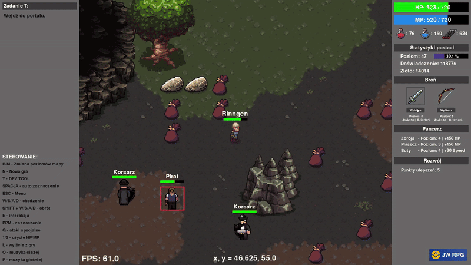
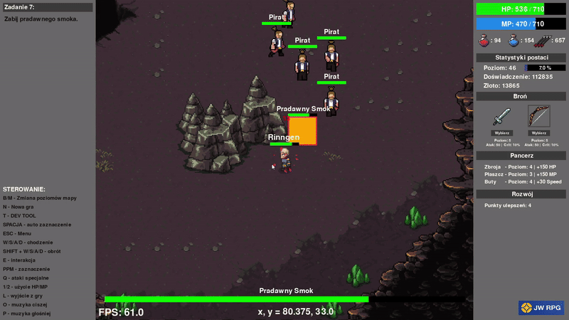
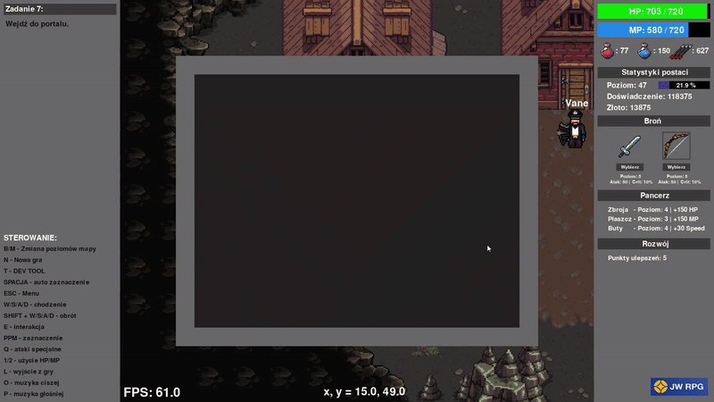

<p align="center">
  
</p>

<p align="center"><b>Gra RPG stworzona w Pythonie z użyciem Pygame - wersja PLACEHOLDER</b></p>

---

## 🛠️ Technologie

- **Python 3** – język programowania  
- **Pygame** – silnik 2D do obsługi grafiki i dźwięku  
- **JSON** – system zapisu i wczytywania stanów gry  
- **OOP** – obiektowe podejście do projektowania mechanik i logiki gry

---

## 🎮 Opis gry i kluczowe funkcje

- Otwarty świat 2D  
- Rozgrywka i walka w czasie rzeczywistym  
- Fabuła obejmująca **7 zadań** z walką z bossem na końcu  
- Inteligentni przeciwnicy wykorzystujący **algorytm A*** do poruszania się  
- System levelowania i rozwoju postaci (punkty umiejętności)  
- Dwa poziomy mapy  
- Dwie bronie: miecz i łuk, możliwość przełączania się między nimi (ataki podstawowe/specjalne)  
- System zapisywania i wczytywania gry  
- Minigra karciana **Blackjack**

> 🧩 **Uwaga:** Repozytorium zawiera placeholdery graficznych assetów ze względu na licencje

---

## 🖼️ GIFy z gry (pełna wersja)

<p align="center">
  
</p>
<p align="center">
  
</p>
<p align="center">
  
</p>

---

## 🚀 Instrukcja uruchomienia

**1️⃣ Sklonuj repozytorium:**
```
git clone https://github.com/jakubwprojects/JW_RPG_PLACEHOLDER.git
cd JW_RPG_PLACEHOLDER
```

**2️⃣ Utwórz i aktywuj środowisko wirtualne (opcjonalnie):**
```
python -m venv .venv
```
Windows:
```
.venv\Scripts\activate
```
Linux / Mac:
```
source .venv/bin/activate
```

**3️⃣ Zainstaluj wymagane pakiety:**
```
pip install -r requirements.txt
```

**4️⃣ Uruchom grę:**
```
python launcher.py
```
---

## ✍️ Autor

**Jakub W**  

✉️ **[jakubw.devmail@gmail.com](mailto:jakubw.devmail@gmail.com)**  
🔗 **[github.com/jakubwprojects](https://github.com/jakubwprojects)**

---
